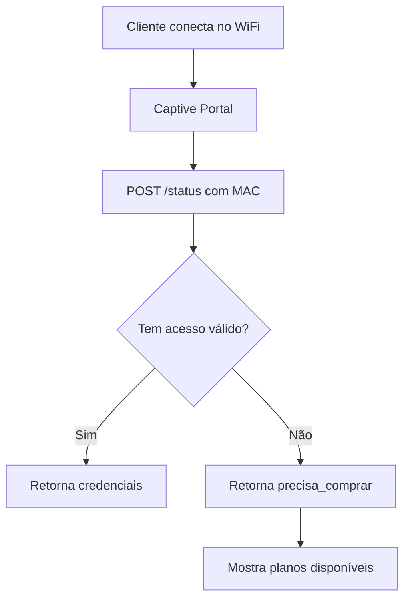
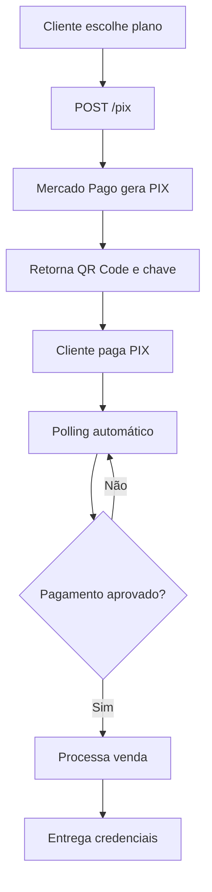
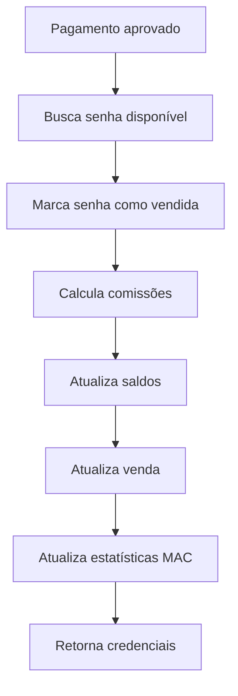

# 🌐 API Captive Portal com PIX

Uma API completa para gerenciamento de captive portal com pagamentos PIX automatizados, integração com Mercado Pago e entrega automática de credenciais WiFi.

## 📋 Índice

- [Visão Geral](#visão-geral)
- [Recursos](#recursos)
- [Configuração](#configuração)
- [Endpoints](#endpoints)
- [Estruturas de Dados](#estruturas-de-dados)
- [Fluxo de Trabalho](#fluxo-de-trabalho)
- [Exemplos de Uso](#exemplos-de-uso)
- [Códigos de Resposta](#códigos-de-resposta)
- [Integração com Frontend](#integração-com-frontend)

## 🎯 Visão Geral

Esta API fornece uma solução completa para captive portals que utilizam pagamentos PIX para liberação de acesso à internet. Desenvolvida para integração com Mikrotiks e sistema de gerenciamento de hotspots.

### Características Principais

- ✅ **Pagamentos PIX Automatizados** - Integração com Mercado Pago
- ✅ **Detecção Automática de Pagamentos** - Verifica status em tempo real
- ✅ **Entrega Automática de Credenciais** - Sem intervenção manual
- ✅ **Gerenciamento de Mikrotiks** - Suporte a múltiplos hotspots
- ✅ **Sistema de Comissões** - Distribuição automática de lucros
- ✅ **Controle de Senhas** - Pool de senhas por plano
- ✅ **Logs Detalhados** - Rastreamento completo de transações

## 🚀 Recursos

### 💳 Sistema de Pagamentos
- Geração automática de PIX via Mercado Pago
- QR Code e chave PIX para pagamento
- Verificação automática de status de pagamento
- Processamento automático de vendas aprovadas

### 🔐 Gerenciamento de Credenciais
- Pool de senhas por plano de internet
- Entrega automática após pagamento
- Controle de senhas ativas/vendidas
- Tempo de validade configurável

### 📊 Sistema Financeiro
- Cálculo automático de comissões
- Distribuição de lucros entre admin e proprietários
- Controle de saldos por cliente
- Histórico completo de transações

### 🌐 Multi-Mikrotik
- Suporte a múltiplos pontos de acesso
- Configuração individual por Mikrotik
- Planos específicos por localização
- Estatísticas por dispositivo

## ⚙️ Configuração

### Variáveis de Ambiente Requeridas

```env
# Supabase
SUPABASE_URL=https://seu-projeto.supabase.co
SUPABASE_SERVICE_ROLE_KEY=sua_service_role_key

# Mercado Pago
MERCADO_PAGO_ACCESS_TOKEN=seu_access_token_mercado_pago

# Servidor (opcional)
PORT=3000
NODE_ENV=production
APP_MODE=backend
```

### Estrutura do Banco de Dados

A API utiliza Supabase com as seguintes tabelas:

- `mikrotiks` - Pontos de acesso registrados
- `planos` - Planos de internet disponíveis
- `senhas` - Pool de credenciais por plano
- `macs` - Dispositivos conectados
- `vendas` - Transações de pagamento
- `clientes` - Proprietários de Mikrotiks

## 🔗 Endpoints

### Base URL
```
http://localhost:3000/api/captive-check
```

### 1. 📋 Status do MAC

Verifica status de um dispositivo e pagamentos pendentes.

**Endpoint:** `POST /status`

**Payload:**
```json
{
  "mac": "AA:BB:CC:DD:EE:FF",
  "mikrotik_id": "uuid-do-mikrotik"
}
```

**Respostas Possíveis:**

#### Precisa Comprar
```json
{
  "status": "precisa_comprar",
  "mac": "AA:BB:CC:DD:EE:FF",
  "mikrotik_id": "uuid-do-mikrotik",
  "total_vendas": 0,
  "total_gasto": 0,
  "ultimo_valor": null,
  "ultimo_plano": null
}
```

#### Pagamento Pendente
```json
{
  "status": "pendente",
  "mac": "AA:BB:CC:DD:EE:FF",
  "mikrotik_id": "uuid-do-mikrotik",
  "total_vendas": 0,
  "total_gasto": 0,
  "ultimo_valor": 0,
  "ultimo_plano": null,
  "pagamento_pendente": {
    "status": "pending",
    "pagamento_gerado_em": "2025-01-20T10:30:00.000Z",
    "chave_pix": "00020126580014br.gov.bcb.pix...",
    "qrcode": "base64_qr_code_image",
    "valor": 5.00,
    "ticket_url": "115712162800",
    "payment_id": "115712162800"
  }
}
```

#### Autenticado (Com Credenciais)
```json
{
  "status": "autenticado",
  "mac": "AA:BB:CC:DD:EE:FF",
  "mikrotik_id": "uuid-do-mikrotik",
  "total_vendas": 1,
  "total_gasto": 5.00,
  "ultimo_valor": 5.00,
  "ultimo_plano": "Plano 1 Hora",
  "username": "user123",
  "password": "pass456",
  "plano": "Plano 1 Hora",
  "duracao": 60,
  "fim": "2025-01-20T11:30:00.000Z"
}
```

### 2. 💰 Gerar PIX

Cria um novo pagamento PIX para liberação de acesso.

**Endpoint:** `POST /pix`

**Payload:**
```json
{
  "mac": "AA:BB:CC:DD:EE:FF",
  "plano_id": "uuid-do-plano",
  "mikrotik_id": "uuid-do-mikrotik",
  "preco": 5.00,
  "descricao": "Acesso WiFi 1 hora"
}
```

**Resposta de Sucesso:**
```json
{
  "id": 115712162800,
  "status": "pending",
  "date_created": "2025-01-20T10:30:00.000Z",
  "date_of_expiration": "2025-01-21T10:30:00.000Z",
  "transaction_amount": 5.00,
  "description": "Acesso WiFi 1 hora",
  "payment_method_id": "pix",
  "point_of_interaction": {
    "transaction_data": {
      "qr_code": "00020126580014br.gov.bcb.pix...",
      "qr_code_base64": "iVBORw0KGgoAAAANSUhEUgAA..."
    }
  },
  "chave_pix": "00020126580014br.gov.bcb.pix...",
  "qrcode": "iVBORw0KGgoAAAANSUhEUgAA...",
  "ticket_url": "115712162800"
}
```

### 3. 🔍 Verificar Pagamento

Verifica status específico de um pagamento pelo ID.

**Endpoint:** `POST /verify`

**Payload:**
```json
{
  "mac": "AA:BB:CC:DD:EE:FF",
  "mikrotik_id": "uuid-do-mikrotik",
  "plano_id": "uuid-do-plano"
}
```

**Resposta:** Similar ao endpoint `/status` mas com foco no pagamento específico.

### 4. 🔄 Polling de Pagamento

Endpoint otimizado para verificação automática de pagamentos.

**Endpoint:** `POST /poll-payment`

**Payload:**
```json
{
  "payment_id": "115712162800"
}
```

**Resposta - Pendente:**
```json
{
  "status": "pending",
  "payment_status": "pending",
  "status_detail": "pending_waiting_payment",
  "message": "Pagamento ainda não foi aprovado"
}
```

**Resposta - Aprovado:**
```json
{
  "status": "approved",
  "payment_status": "approved",
  "username": "user123",
  "password": "pass456",
  "plano": "Plano 1 Hora",
  "duracao": 60,
  "message": "Pagamento aprovado e processado com sucesso"
}
```

### 5. ✅ Health Check

Verifica se a API está funcionando.

**Endpoint:** `GET /`

**Resposta:**
```json
{
  "status": "ok",
  "message": "API está funcionando!"
}
```

## 📊 Estruturas de Dados

### MAC Address
```typescript
interface MacData {
  id: string;
  mac_address: string;
  mikrotik_id: string;
  status: 'coletado' | 'ativo';
  primeiro_acesso: string;
  ultimo_acesso: string | null;
  total_compras: number;
  ultimo_plano: string;
  ultimo_valor: number;
  total_gasto: number;
  status_pagamento: 'aguardando' | 'aprovado';
  chave_pix: string;
  qrcode: string;
  pagamento_aprovado_em: string | null;
}
```

### Venda/Transação
```typescript
interface Venda {
  id: string;
  mac_id: string;
  plano_id: string;
  mikrotik_id: string;
  preco: number;
  descricao: string;
  status: 'aguardando' | 'pendente' | 'aprovado' | 'expirado';
  payment_id: string;
  chave_pix: string;
  qrcode: string;
  ticket_url: string;
  data: string;
  pagamento_gerado_em: string;
  pagamento_aprovado_em: string | null;
  senha_id: string | null;
}
```

### Plano
```typescript
interface Plano {
  id: string;
  nome: string;
  preco: number;
  duracao: number; // em minutos
  mikrotik_id: string;
}
```

### Senha/Credencial
```typescript
interface Senha {
  id: string;
  usuario: string;
  senha: string;
  plano_id: string;
  vendida: boolean;
  vendida_em: string | null;
}
```

## 🔄 Fluxo de Trabalho

### 1. Verificação Inicial

```mermaid
graph TD
    A[Cliente conecta no WiFi] --> B[Captive Portal]
    B --> C[POST /status com MAC]
    C --> D{Tem acesso válido?}
    D -->|Sim| E[Retorna credenciais]
    D -->|Não| F[Retorna precisa_comprar]
    F --> G[Mostra planos disponíveis]
```

### 2. Processo de Pagamento

```mermaid
graph TD
    A[Cliente escolhe plano] --> B[POST /pix]
    B --> C[Mercado Pago gera PIX]
    C --> D[Retorna QR Code e chave]
    D --> E[Cliente paga PIX]
    E --> F[Polling automático]
    F --> G{Pagamento aprovado?}
    G -->|Não| F
    G -->|Sim| H[Processa venda]
    H --> I[Entrega credenciais]
```

### 3. Entrega de Credenciais

```mermaid
graph TD
    A[Pagamento aprovado] --> B[Busca senha disponível]
    B --> C[Marca senha como vendida]
    C --> D[Calcula comissões]
    D --> E[Atualiza saldos]
    E --> F[Atualiza venda]
    F --> G[Atualiza estatísticas MAC]
    G --> H[Retorna credenciais]
```

## 💻 Exemplos de Uso

### Exemplo Completo - JavaScript

```javascript
const API_BASE = 'http://localhost:3000/api/captive-check';

// 1. Verificar status inicial
async function verificarStatus(mac, mikrotikId) {
  const response = await fetch(`${API_BASE}/status`, {
    method: 'POST',
    headers: { 'Content-Type': 'application/json' },
    body: JSON.stringify({
      mac: mac,
      mikrotik_id: mikrotikId
    })
  });
  
  return await response.json();
}

// 2. Gerar PIX para pagamento
async function gerarPix(mac, planoId, mikrotikId, preco) {
  const response = await fetch(`${API_BASE}/pix`, {
    method: 'POST',
    headers: { 'Content-Type': 'application/json' },
    body: JSON.stringify({
      mac: mac,
      plano_id: planoId,
      mikrotik_id: mikrotikId,
      preco: preco,
      descricao: 'Acesso WiFi'
    })
  });
  
  if (!response.ok) {
    throw new Error(`Erro ao gerar PIX: ${response.status}`);
  }
  
  return await response.json();
}

// 3. Polling automático de pagamento
async function iniciarPolling(paymentId, callback) {
  const interval = setInterval(async () => {
    try {
      const response = await fetch(`${API_BASE}/poll-payment`, {
        method: 'POST',
        headers: { 'Content-Type': 'application/json' },
        body: JSON.stringify({ payment_id: paymentId })
      });
      
      const data = await response.json();
      
      if (data.status === 'approved') {
        clearInterval(interval);
        callback(null, data);
      } else if (data.status === 'error') {
        clearInterval(interval);
        callback(new Error(data.message));
      }
    } catch (error) {
      console.error('Erro no polling:', error);
    }
  }, 5000); // Verifica a cada 5 segundos
  
  // Para o polling após 10 minutos
  setTimeout(() => {
    clearInterval(interval);
    callback(new Error('Tempo limite de pagamento'));
  }, 600000);
}

// Exemplo de uso completo
async function fluxoCompleto() {
  const mac = 'AA:BB:CC:DD:EE:FF';
  const mikrotikId = 'uuid-do-mikrotik';
  const planoId = 'uuid-do-plano';
  const preco = 5.00;
  
  try {
    // 1. Verificar status
    const status = await verificarStatus(mac, mikrotikId);
    console.log('Status:', status);
    
    if (status.status === 'autenticado') {
      console.log('Já tem acesso:', status.username, status.password);
      return;
    }
    
    // 2. Gerar PIX
    const pixData = await gerarPix(mac, planoId, mikrotikId, preco);
    console.log('PIX gerado:', pixData.chave_pix);
    
    // 3. Iniciar polling
    iniciarPolling(pixData.id, (error, result) => {
      if (error) {
        console.error('Erro:', error.message);
      } else {
        console.log('Pagamento aprovado!');
        console.log('Credenciais:', result.username, result.password);
      }
    });
    
  } catch (error) {
    console.error('Erro no fluxo:', error);
  }
}
```

### Exemplo - cURL

```bash
# Verificar status
curl -X POST http://localhost:3000/api/captive-check/status \
  -H "Content-Type: application/json" \
  -d '{
    "mac": "AA:BB:CC:DD:EE:FF",
    "mikrotik_id": "uuid-do-mikrotik"
  }'

# Gerar PIX
curl -X POST http://localhost:3000/api/captive-check/pix \
  -H "Content-Type: application/json" \
  -d '{
    "mac": "AA:BB:CC:DD:EE:FF",
    "plano_id": "uuid-do-plano",
    "mikrotik_id": "uuid-do-mikrotik",
    "preco": 5.00,
    "descricao": "Acesso WiFi 1 hora"
  }'

# Verificar pagamento
curl -X POST http://localhost:3000/api/captive-check/poll-payment \
  -H "Content-Type: application/json" \
  -d '{
    "payment_id": "115712162800"
  }'
```

## ⚠️ Códigos de Resposta

### Sucesso (2xx)
- `200 OK` - Operação realizada com sucesso
- `201 Created` - Recurso criado com sucesso

### Erro Cliente (4xx)
- `400 Bad Request` - Dados inválidos ou ausentes
- `404 Not Found` - Recurso não encontrado
- `409 Conflict` - Conflito (ex: pagamento pendente já existe)

### Erro Servidor (5xx)
- `500 Internal Server Error` - Erro interno do servidor
- `503 Service Unavailable` - Serviço temporariamente indisponível

### Estrutura de Erro Padrão
```json
{
  "error": "Descrição do erro",
  "code": "CODIGO_ERRO",
  "details": "Detalhes específicos",
  "source": "API|Supabase|MercadoPago"
}
```

## 🎨 Integração com Frontend

### Polling Automático Recomendado

```javascript
// Componente React exemplo
function PagamentoPix({ mac, mikrotikId, planoId, preco }) {
  const [pixData, setPixData] = useState(null);
  const [credenciais, setCredenciais] = useState(null);
  const [polling, setPolling] = useState(false);
  
  const gerarPix = async () => {
    const response = await fetch('/api/captive-check/pix', {
      method: 'POST',
      headers: { 'Content-Type': 'application/json' },
      body: JSON.stringify({ mac, plano_id: planoId, mikrotik_id: mikrotikId, preco })
    });
    
    const data = await response.json();
    setPixData(data);
    
    // Inicia polling automático
    iniciarPolling(data.id);
  };
  
  const iniciarPolling = (paymentId) => {
    setPolling(true);
    
    const interval = setInterval(async () => {
      const response = await fetch('/api/captive-check/poll-payment', {
        method: 'POST',
        headers: { 'Content-Type': 'application/json' },
        body: JSON.stringify({ payment_id: paymentId })
      });
      
      const data = await response.json();
      
      if (data.status === 'approved') {
        setCredenciais(data);
        setPolling(false);
        clearInterval(interval);
      }
    }, 5000);
    
    // Para após 10 minutos
    setTimeout(() => {
      clearInterval(interval);
      setPolling(false);
    }, 600000);
  };
  
  return (
    <div>
      {!pixData && (
        <button onClick={gerarPix}>Gerar PIX</button>
      )}
      
      {pixData && !credenciais && (
        <div>
          
          <p>Chave PIX: {pixData.chave_pix}</p>
          {polling && <p>Verificando pagamento...</p>}
        </div>
      )}
      
      {credenciais && (
        <div>
          <h3>Acesso Liberado!</h3>
          <p>Usuário: {credenciais.username}</p>
          <p>Senha: {credenciais.password}</p>
        </div>
      )}
    </div>
  );
}
```

## 🔧 Configurações Avançadas

### Timeout de Pagamento
Os pagamentos PIX expiram automaticamente após 10 minutos. O sistema marca vendas como "expirado" e limpa dados de pagamento.

### Sistema de Comissões
```javascript
// Configuração no banco de dados (tabela mikrotiks)
{
  profitpercentage: 90 // 90% para dono, 10% para admin
}
```

### Logs e Debug
A API gera logs detalhados para todas as operações:
- `[STATUS]` - Verificações de status
- `[PIX]` - Geração de pagamentos
- `[POLL-PAYMENT]` - Verificação de pagamentos
- `[VENDA APROVADA]` - Processamento de vendas

### Rate Limiting
Recomenda-se implementar rate limiting para evitar spam:
- `/pix`: Máximo 1 request por minuto por MAC
- `/poll-payment`: Máximo 1 request por 5 segundos

## 📞 Suporte

Para suporte técnico ou dúvidas sobre a implementação:

1. Verifique os logs da aplicação
2. Confirme as variáveis de ambiente
3. Teste a conectividade com Supabase e Mercado Pago
4. Consulte a documentação do Mercado Pago para códigos de erro específicos

---

**Desenvolvido com ❤️ para captive portals modernos e eficientes.**